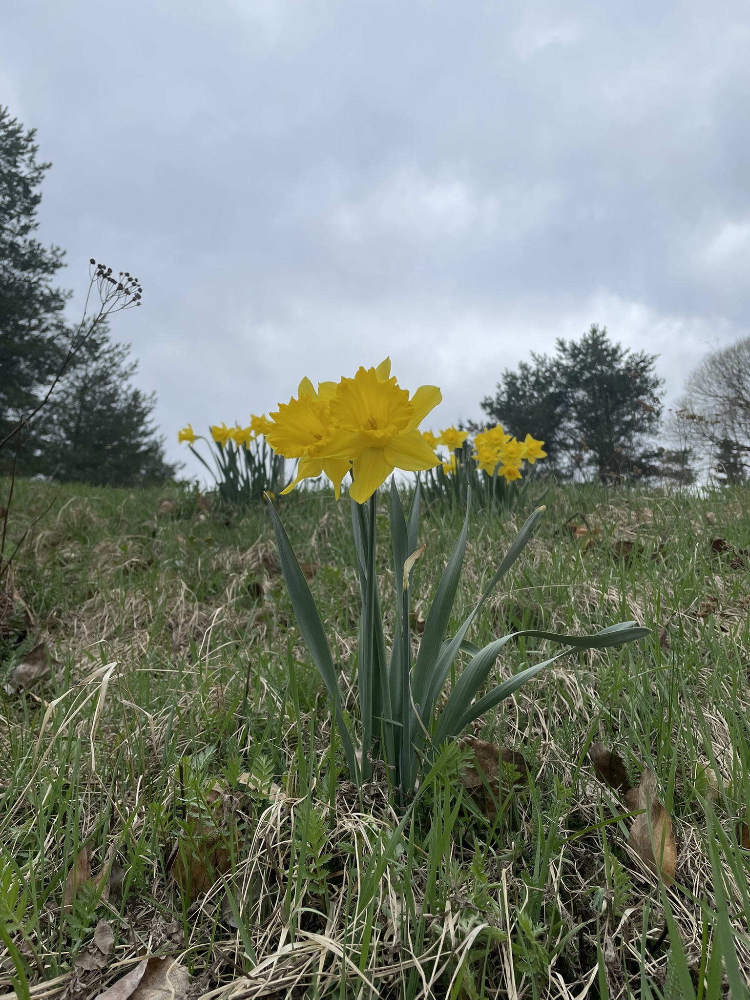

## Thoughts

A thought often arises that wonders how I could disappear with minimal harm to those who find my presence in some way meaningful in their lives.
The thinker of thoughts observes the arising thought and witnesses as how it is accompanied by the almost imperceptible worries and concerns that fuel it.
These worries and concerns camouflage themselves against the canvas of the theater of the mind.

One seems to have the challenge of both recognising the cinematic nature of the passing moment and the construction that is crafted by these chameleonts of experience.
Crafted by fear, desire, judgement, wanting or not wanting in one form or another.
Often adding small distortions to the sensory stream that flows from me to you and you to me.
Influencing how we understand each other.

    Life treats you a treat if you treat it like a Tree. 
    Hugs, kisses and good wishes.

I try to love those composing creatures hanging on to that thread of thought.
I recently encountered an opportunity to learn to love by a tumultuous chain of events that evidenced the absense of love in me.
Yet I again and again find myself confused when faced with expressions of love from friends and family.

    Like colors described to a colorblind.
    Is love expressed to one who learned to fear love.

## Love
I've learned to say "I love you" to my cat friend. It has always been easier with non-human animals.
And when I do, that is when those cinematic creatures clinging to that thread of life let go and free fall into emptiness.

    You who find yourself 
    hanging onto that single thread of life
    
    Your darkness a vast ocean of blue
    amidst a single ray of light
    
    inhale and exhale
    the waves that rock to eternal sleep
    all who enter that impenetrable darkness of the forest.

These four elements have found themselves present in my recent life:

    Tears fall like rain from the sky.
    Compassion radiates like the nordic summer sun.
    Good will sings like the birds of spring.
    Silence welcomes stillness like the emptiness within.

A community in its caring, sharing and goodwill are defining for me what love might be.
Eye contact, respectful mutual sharing, uninterrupted listening...

Interactions in this community have taught me that thoughts and expressions I've shared have value in people's lives.
Thus I now share them in writing. 
May they bring to you and those around you an inner light that keeps one warm and loved.

## Light in small things.

Today I brewed my 3rd batch of kombucha.
I find a peculiar feeling in my heart when I lift the [SCOBY](https://en.wikipedia.org/wiki/SCOBY) out of the liquid.
The same feeling is present when I cook for my friends or smile to a passing stranger and whisper a blessing from my heart to theirs.

Sometimes ill will arises in interaction with another person. 
That ill will is welcomed by compassion and listening.
Often what I hear is my own fear or unmet need of some sort. 

With recognition, listening and compassion towards the past hurt, this ill will transforms into good will towards that person.
Hereafter the peculiar feeling in my heart arises again.
Is it that we need to make room for love in our hearts?

Yesterday in a communal sharing circle that feeling was very large.
Like a colossal postmodern art piece in the gallery of the mind of a stoneaged hunter-gatherer.
I couldn't find anything from my repertoire of experiences that could provide a reference with respect to which to measure this moment.
This moment was a defining moment. Perhaps of love.

I find light in creation of music.
Even though my current musical skills are very crude and rudimentary, it's a form of listening to what the tiny I's in me have to say.
An opportunity to love by listening. 

I'm eagerly seeking to co-create music so if you're reading this far and have any interest in such activity with me, do reach out. I play drums and enjoy writing songs.

Also if you have any thoughts on these kinds of matters of heart, mind and life feel free to reach out to discuss.

Peace and happiness

Nick
